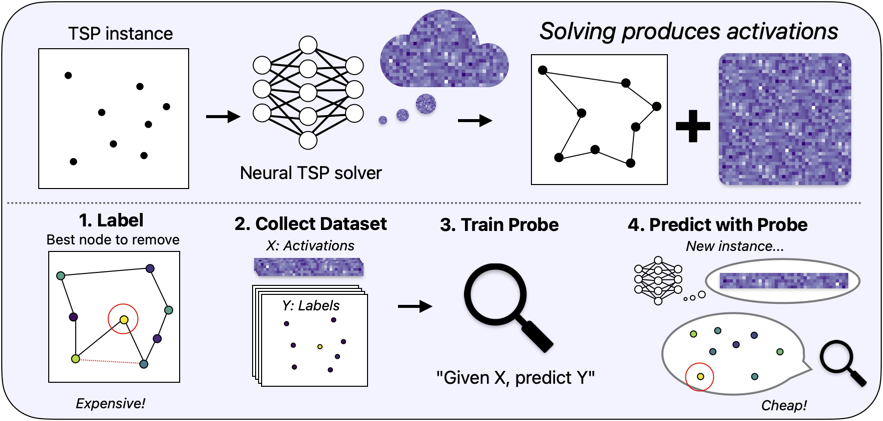
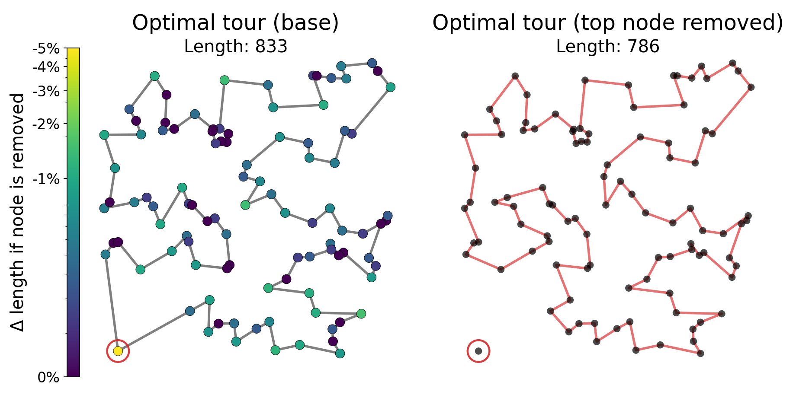
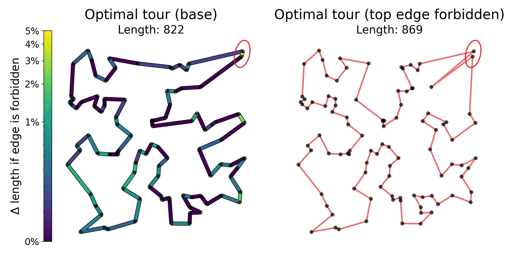

# Prescriptive Probing of Neural TSP Representations



Code for the paper on **prescriptive probing** of neural TSP solvers. We train an attention-based TSP policy, generate exact labels with Concorde about useful what-if sensitivity tasks (node removal and edge forbid), extract frozen encoder representations, and train probes for both tasks. Paper link:

[ _arXiv link coming soon._ ]

**What-if tasks: label visualization**

**Node removal**


**Edge forbid**


**Steps to reproduce:**
1. Install deps and Concorde: `pip install -r requirements.txt`, and install Concorde from https://www.math.uwaterloo.ca/tsp/concorde/downloads/downloads.htm (ensure `concorde` is on PATH).
2. Train a TSP policy (creates `runs/<run_name>`):
```bash
bash scripts/train_policy.sh
```
3. Collect labels (exact Concorde re-solves):
```bash
bash scripts/collect_labels_node_removal.sh runs/<run_name> 3000 20
bash scripts/collect_labels_edge_forbid.sh runs/<run_name> 1000 10
```
4. Extract representations:
```bash
bash scripts/extract_activations.sh node_removal \
  --data_dir tasks/node_removal/data/processed/<dataset_id> \
  --run_dir runs/<run_name>

bash scripts/extract_activations.sh edge_forbid \
  --data_dir tasks/edge_forbid/data/processed/<dataset_id> \
  --run_dir runs/<run_name>
```
5. Train probes:
```bash
bash scripts/train_probes.sh \
  --reps_path tasks/node_removal/data/processed/<dataset_id>/probe_reps.pt \
  --target length --objective regression --model transformer
```
